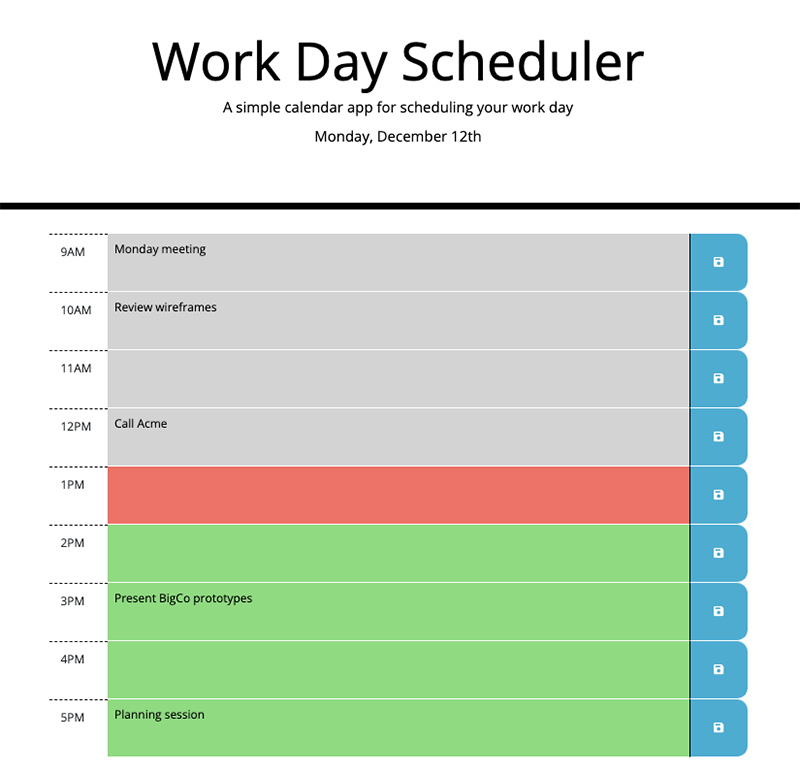

# work-day-scheduler
Exercise for the Trilogy Front End Development course, making use of the Moment.js library

This challenge was set as part of [the Trilogy Skills Bootcamp in Front-End Web Development](https://skillsforlife.edx.org/coding/frontend/landing/?s=Google-Unbranded&pkw=web%20design%20training&pcrid=624628533241&pmt=p&utm_source=google&utm_medium=cpc&utm_campaign=GGL%7CSKILLS-FOR-LIFE%7CSEM%7CCODING%7C-%7COFL%7CTIER-1%7CALL%7CNBD-G%7CBMM%7CPrimary%7CSubject-Matter&utm_term=web%20design%20training&s=google&k=web%20design%20training&utm_adgroupid=140443158663&utm_locationphysicalms=1006886&utm_matchtype=p&utm_network=g&utm_device=c&utm_content=624628533241&utm_placement=&gclid=Cj0KCQjwqc6aBhC4ARIsAN06NmMdwBRSe3BLeaChkukN5Bbqb18220k1ku9TB2o9tzsX0xYUc-dlRWgaAuyvEALw_wcB&gclsrc=aw.ds). The starter files we were provided can be viewed in [this commit](https://github.com/paulashby/work-day-scheduler/tree/55984f06d3e3f1b25bd8878e302933f36afc211e).

The acceptance criterea were to create a web app that would:

* Display the current day at the top of the calendar when a user opens the planner.

* Present timeblocks for standard business hours when the user scrolls down.

* Color-code each timeblock based on past, present, and future when the timeblock is viewed.

* Allow a user to enter an event when they click a timeblock.

* Save the event in local storage when the save button is clicked in that timeblock.

* Persist events between refreshes of a page.

The project has been [deployed on GitHub Pages](https://paulashby.github.io/work-day-scheduler).

## Installation

If for any reason you would like to deploy the website yourself, simply fork this repository, go to the Settings page of your fork on GitHub, select <kbd>Pages</kbd> and set the <kbd>Branch</kbd> dropdown to <kbd>main</kbd>.

## Usage

Visit [the deployed page](https://paulashby.github.io/work-day-scheduler), enter an item in a timeslot and click the floppy disc icon to persist your data via localStorage,

## Credits
Thanks to [the Trilogy Skills Bootcamp in Front-End Web Development](https://skillsforlife.edx.org/coding/frontend/landing/?s=Google-Unbranded&pkw=web%20design%20training&pcrid=624628533241&pmt=p&utm_source=google&utm_medium=cpc&utm_campaign=GGL%7CSKILLS-FOR-LIFE%7CSEM%7CCODING%7C-%7COFL%7CTIER-1%7CALL%7CNBD-G%7CBMM%7CPrimary%7CSubject-Matter&utm_term=web%20design%20training&s=google&k=web%20design%20training&utm_adgroupid=140443158663&utm_locationphysicalms=1006886&utm_matchtype=p&utm_network=g&utm_device=c&utm_content=624628533241&utm_placement=&gclid=Cj0KCQjwqc6aBhC4ARIsAN06NmMdwBRSe3BLeaChkukN5Bbqb18220k1ku9TB2o9tzsX0xYUc-dlRWgaAuyvEALw_wcB&gclsrc=aw.ds) for dreaming up the exercise. Thanks also to Philip Howley, the course Instructor and Brooke Love, my personal teaching assistant.

## License
Licensed under the [MIT](https://github.com/paulashby/work-day-scheduler/blob/main/LICENSE) license.

